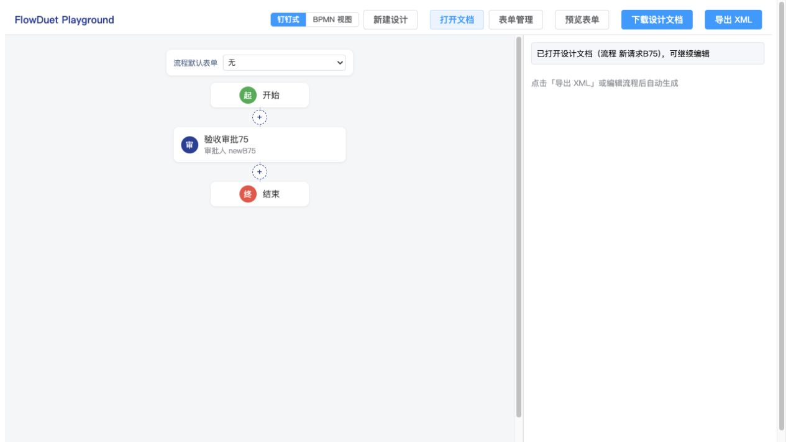
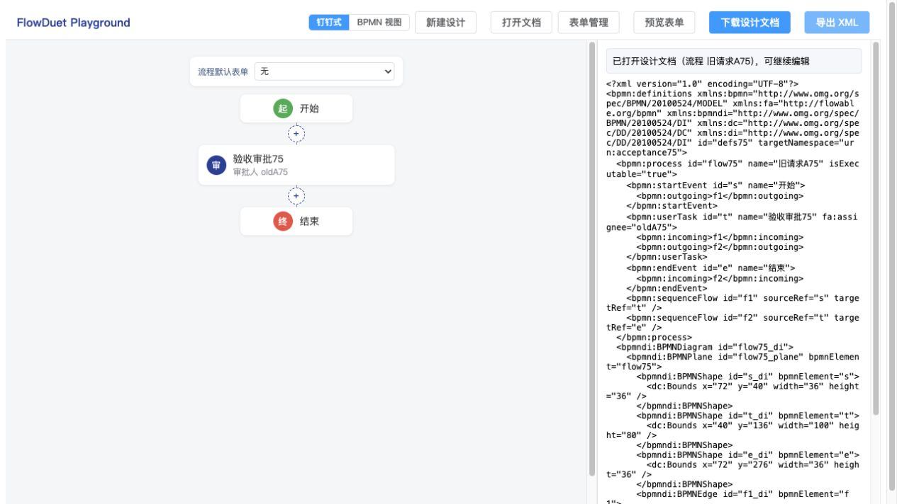

# #75 Codex 自带浏览器产品功能验收（2026-09-30）

本轮不能判定完整文件打开边界通过。62 个用例全部执行或尝试：59 个通过、2 个部分完成、1 个失败。#75 聚焦的 55 个文件恢复/拒绝用例全部通过；父规格 A14 的慢文件竞态 X06 失败。完整用例定义见 [`75-functional-test-cases.md`](../75-functional-test-cases.md)。

## 被测环境与证据性质

- 版本：`acc4d4e2235dcc7d4c658168bb572d3446b92044`，PR #87，分支 `feat/75-document-compat-atomic-open`。本轮没有修改产品代码。
- 宿主：现有 Playground 的已构建 dist，`http://127.0.0.1:5207/`，通过本轮启动的 Vite preview 服务访问。
- 浏览器：Codex In-app Browser，当前任务中原生文件选择器、页面按钮、节点抽屉、真实 FormCreate 设计器与渲染器均参与执行；没有用单元测试代替本轮浏览器结果。
- 每个文件用例均独立选择并观察结果。拒绝用例不是只看抛错：先从合法基线通过界面改节点名“未保存审批75”和字段标题“未保存标记75”，保留审批人 keep75、默认绑定和未绑定表单；每次失败后重新生成 XML 和设计文档，比较模型与表单目录/规则，39 项均未变化。
- [原始结果 JSON](./75-browser-run/results.json)保存每个编号、实际错误、原子保留与结果；[manifest](./75-browser-fixtures/manifest.json)索引冻结输入夹具。表单全字段正例复用 #74 有来源的八字段/基础两列规则，只验恢复兼容，不据此宣称重做 #74 所有设计功能。
- 创建测试夹具时发现可变模板引用造成污染，执行拒绝矩阵前已改用深拷贝重新生成；本报告仅使用修正后的单因素变体结果，不将先前污染基线的错误算作产品缺陷。

## 辅助操作与限制

- 原生文件上传可用。下载事件等待 5 秒未返回路径，用户 Downloads 中未找到该次 flow75 产物；这只构成落盘证据缺口，不等同于下载产品失败。
- 为核对实际产物，临时包装页面 `URL.createObjectURL`：读取真实传入的 Blob，但仍调用原方法，不修改其内容、不替换保存结果。由页面“下载设计文档”按钮生成的 JSON 写入证据目录，再通过原生选择器打开。因此证明产品序列化、往返与试填隔离；不证明原生下载落盘完成，X01 记部分完成。
- X05 仅让指定测试文件的 `File.text()` 返回读取错误；X06 仅通过可手动释放的 Promise 延迟 A 文件的读取，B 的读取及后续解析均真实执行。没有模拟 session.open 的成功或失败，没有直接改写应用模型。
- 选择器不接受空文件列表，也未暴露取消方法；同文件重复打开已通过，人工原生取消操作未完成，X03 记部分完成。
- 结束前已恢复 `URL.createObjectURL` 与 `File.prototype.text`，删除临时辅助全局变量，浏览器留在合法默认绑定表单预览。预览服务保留供复查。

## 需求覆盖

| #75 目标/边界                                                 | 用例与观察                                                                                     |
| ------------------------------------------------------------- | ---------------------------------------------------------------------------------------------- |
| 外层格式、版本、引擎、提供者、表单 ID、rules/options 恢复守卫 | E01–E13 全部拒绝且保留现有设计；P12 同名不同 ID 合法                                           |
| 单流程可编辑结构、超子集与无法识别语义                        | E14/E15/E19、S01–S05 全部明确拒绝；P01/P02 可恢复                                              |
| 标准草稿与真实扩展冲突区分                                    | P01/P02/P05；E16–E19                                                                           |
| URI、前缀、作用域、项目扩展                                   | P03–P10、E20–E25；字符引用可恢复、非法保留绑定拒绝、不做 URI 大小写/%归一化                    |
| 失效 key 属于业务草稿，不回退默认                             | D01–D03；默认/覆盖失效阻断相关预览和导出，合法覆盖可预览但失效默认仍阻断导出                   |
| 组件支持范围复用实际已开放能力                                | P11 恢复八字段与两列并可继续进入真实设计器保存；S06–S11 超组件/远程/脚本/重复标识/嵌套布局拒绝 |
| 成功整体替换、失败保留未保存模型与目录                        | 全部 39 个 E/S/L 用例的原子对比；X05 读取失败、X07 合法/非法交替恢复                           |
| 三项复审修复                                                  | P06/P07 正确 URI 字符引用；E20–E22 保留命名空间拒绝；L01–L03 均定位属性名第 5 行               |
| 不改旧 core parse 通用入口                                    | 浏览器无直接旧入口，使用 PR 已执行的源码回归和 Node 22/24 CI 作为旁证，不标作浏览器验收        |
| 父规格相邻文件边界 A14/A15/A16                                | X01–X07；慢文件竞态失败，原生下载与取消有证据缺口                                              |

## 用例逐项执行结果

| 编号 | 场景                             | 结果             | 实际观察/证据                                                                                                                                                                                                                                                                          |
| ---- | -------------------------------- | ---------------- | -------------------------------------------------------------------------------------------------------------------------------------------------------------------------------------------------------------------------------------------------------------------------------------- |
| P01  | 无方言无审批人的标准草稿         | 通过             | 标准草稿从原生文件选择器打开；导出明确阻断审批人缺失; 实际产品 Blob 保存并原生重开后仍是缺审批人的草稿                                                                                                                                                                                 |
| P02  | 配置完整的纯流程                 | 通过             | 原生文件打开成功，XML 导出保留审批人 john; 从 P02 恢复后在节点抽屉改名，导出 XML 保留新名与 john                                                                                                                                                                                       |
| P03  | Flowable 更名前缀                | 通过             | 原生文件打开成功，XML 导出保留审批人 john                                                                                                                                                                                                                                              |
| P04  | 项目默认表单扩展更名前缀         | 通过             | 默认引用 fd:defaultFormKey 恢复；节点继承并真实渲染 reason75=原始默认值75; 从产品 Blob 文件重开后默认绑定与原始默认值保持                                                                                                                                                              |
| P05  | 仅声明未使用 Camunda 命名空间    | 通过             | 原生文件打开成功，XML 导出保留审批人 john                                                                                                                                                                                                                                              |
| P06  | xmlns 十进制字符引用             | 通过             | 原生文件打开成功，XML 导出保留审批人 john; 辅助捕获产品 Blob 并从原生选择器重开，john 保留（原生下载落盘未证实）                                                                                                                                                                       |
| P07  | xmlns 十六进制字符引用           | 通过             | 原生文件打开成功，XML 导出保留审批人 john; 辅助捕获产品 Blob 并从原生选择器重开，john 保留（原生下载落盘未证实）                                                                                                                                                                       |
| P08  | 属性使用先于同标签声明           | 通过             | 原生文件打开成功，XML 导出保留审批人 john                                                                                                                                                                                                                                              |
| P09  | 嵌套作用域重新绑定合法 URI       | 通过             | 原生文件打开成功，XML 导出保留审批人 john                                                                                                                                                                                                                                              |
| P10  | 合法 xml 显式绑定与基础属性      | 通过             | 原生文件打开成功，XML 导出保留审批人 john                                                                                                                                                                                                                                              |
| P11  | 已开放八字段与基础行列布局       | 通过             | 八类字段与两列布局实际渲染；真实设计器恢复全部内容并可保存表单                                                                                                                                                                                                                         |
| P12  | 同名不同 ID 表单                 | 通过             | 同名表单 f_apply/f_second 均恢复，目录和绑定选择可用 ID 区分                                                                                                                                                                                                                           |
| D01  | 失效默认 key 作为草稿            | 通过             | ghost_default 原样保留并定位；节点预览显示引用失效，部署导出受阻                                                                                                                                                                                                                       |
| D02  | 失效覆盖不回退合法默认           | 通过             | {"deployError": ["审批节点「验收审批75（t）」的表单 key「ghost_override」不在表单目录中（已保留原值，请修复引用）"], "previewError": ["表单引用失效：key「ghost_override」不在表单目录中（保留原值，请修复）"], "rendered": 0}                                                         |
| D03  | 失效默认即使无人继承仍阻断导出   | 通过             | {"deployError": ["流程默认表单 key「ghost_default」不在表单目录中（已保留原值，请修复引用或补建表单）"], "previewError": [], "rendered": 1}                                                                                                                                            |
| D04  | 未绑定表单与草稿保存往返         | 通过             | 产品 Blob 草稿重开，两张未绑定表单保留，审批人缺失仍拦截导出                                                                                                                                                                                                                           |
| E01  | 坏 JSON                          | 通过             | 设计文档不是合法 JSON：Expected property name or '}' in JSON at position 1 (line 1 column 2)；重新生成的 XML、目录与未保存标记全部保持                                                                                                                                                 |
| E02  | 外层非对象                       | 通过             | 设计文档必须是 JSON 对象；重新生成的 XML、目录与未保存标记全部保持                                                                                                                                                                                                                     |
| E03  | 未知 format                      | 通过             | 未知的设计文档格式：期望 "flowduet.design"，实际 "other.design"；重新生成的 XML、目录与未保存标记全部保持                                                                                                                                                                              |
| E04  | 未知 version                     | 通过             | 不支持的设计文档版本：期望 1，实际 2；不自动迁移；重新生成的 XML、目录与未保存标记全部保持                                                                                                                                                                                             |
| E05  | 未知 engine                      | 通过             | 不支持的目标引擎：期望 "flowable"，实际 "camunda"；不猜测适配器；重新生成的 XML、目录与未保存标记全部保持                                                                                                                                                                              |
| E06  | 未知提供者                       | 通过             | 表单 f_apply 的提供者是 other/vendor，本版本只支持 form-create/element-plus；重新生成的 XML、目录与未保存标记全部保持                                                                                                                                                                  |
| E07  | 重复表单 ID                      | 通过             | 表单 id 重复：f_apply（文档内 id 必须唯一）；重新生成的 XML、目录与未保存标记全部保持                                                                                                                                                                                                  |
| E08  | 缺失 rules                       | 通过             | 表单 f_apply 的 rules/options 必须是字符串；重新生成的 XML、目录与未保存标记全部保持                                                                                                                                                                                                   |
| E09  | 坏 rules JSON                    | 通过             | 表单 rules 不是合法 JSON：Expected property name or '}' in JSON at position 1 (line 1 column 2)；重新生成的 XML、目录与未保存标记全部保持                                                                                                                                              |
| E10  | 坏 options JSON                  | 通过             | 表单 options 不是合法 JSON：Expected property name or '}' in JSON at position 1 (line 1 column 2)；重新生成的 XML、目录与未保存标记全部保持                                                                                                                                            |
| E11  | options 非对象                   | 通过             | 表单 options 必须是 JSON 对象；重新生成的 XML、目录与未保存标记全部保持                                                                                                                                                                                                                |
| E12  | rules 非数组                     | 通过             | 表单 rules 必须是字段规则数组（JSON 数组）；重新生成的 XML、目录与未保存标记全部保持                                                                                                                                                                                                   |
| E13  | 空白表单名                       | 通过             | 表单 f_apply 的名称不能为空白；重新生成的 XML、目录与未保存标记全部保持                                                                                                                                                                                                                |
| E14  | 坏 XML                           | 通过             | 文档 XML 无法解析：unparsable content <bpmn:broken detected； line: 0； column: 0； nested error: unclosed tag；重新生成的 XML、目录与未保存标记全部保持                                                                                                                               |
| E15  | 重复 XML ID                      | 通过             | 文档 XML 无法解析：XML 解析产生警告：unparsable content <bpmn:userTask> detected； line: 8； column: 4； nested error: duplicate ID <t>；重新生成的 XML、目录与未保存标记全部保持                                                                                                      |
| E16  | 实际使用未知 URI 属性            | 通过             | 文档 XML 使用了当前引擎适配器不支持的扩展：XML 实际使用了未注册命名空间的内容：第 5 行的 x:assignee（前缀 "x"，命名空间 urn:unsupported75）。这些内容不在目标适配器与项目协议的已注册扩展范围内，无法无损恢复，拒绝打开；重新生成的 XML、目录与未保存标记全部保持                      |
| E17  | 假 flowable 前缀                 | 通过             | 文档 XML 使用了当前引擎适配器不支持的扩展：XML 实际使用了未注册命名空间的内容：第 5 行的 flowable:assignee（前缀 "flowable"，命名空间 urn:fake-flowable75）。这些内容不在目标适配器与项目协议的已注册扩展范围内，无法无损恢复，拒绝打开；重新生成的 XML、目录与未保存标记全部保持      |
| E18  | 实际使用冲突扩展元素             | 通过             | 文档 XML 使用了当前引擎适配器不支持的扩展：XML 实际使用了未注册命名空间的内容：第 9 行的 c:taskListener（前缀 "c"，命名空间 http://camunda.org/schema/1.0/bpmn）。这些内容不在目标适配器与项目协议的已注册扩展范围内，无法无损恢复，拒绝打开；重新生成的 XML、目录与未保存标记全部保持 |
| E19  | 已注册 URI 中未知属性            | 通过             | 文档 XML 无法解析：XML 解析产生警告：unknown attribute <flowable:unknown75>；重新生成的 XML、目录与未保存标记全部保持                                                                                                                                                                  |
| E20  | 非法 xml 前缀重绑 Camunda        | 通过             | 文档 XML 无法解析：第 2 行的 xmlns:xml 是非法保留命名空间声明：http://camunda.org/schema/1.0/bpmn；重新生成的 XML、目录与未保存标记全部保持                                                                                                                                            |
| E21  | 非法 xml 前缀重绑已注册 Flowable | 通过             | 文档 XML 无法解析：第 2 行的 xmlns:xml 是非法保留命名空间声明：http://flowable.org/bpmn；重新生成的 XML、目录与未保存标记全部保持                                                                                                                                                      |
| E22  | 其他前缀非法绑定保留 XML URI     | 通过             | 文档 XML 无法解析：第 2 行的 xmlns:other 是非法保留命名空间声明：http://www.w3.org/XML/1998/namespace；重新生成的 XML、目录与未保存标记全部保持                                                                                                                                        |
| E23  | URI 百分号编码不作为同 URI       | 通过             | 文档 XML 使用了当前引擎适配器不支持的扩展：XML 实际使用了未注册命名空间的内容：第 5 行的 fa:assignee（前缀 "fa"，命名空间 http://flowable.org/bp%6Dn）。这些内容不在目标适配器与项目协议的已注册扩展范围内，无法无损恢复，拒绝打开；重新生成的 XML、目录与未保存标记全部保持           |
| E24  | URI 大小写不归一化               | 通过             | 文档 XML 使用了当前引擎适配器不支持的扩展：XML 实际使用了未注册命名空间的内容：第 5 行的 fa:assignee（前缀 "fa"，命名空间 HTTP://flowable.org/bpmn）。这些内容不在目标适配器与项目协议的已注册扩展范围内，无法无损恢复，拒绝打开；重新生成的 XML、目录与未保存标记全部保持             |
| E25  | 作用域退出后不沿用内层绑定       | 通过             | 文档 XML 使用了当前引擎适配器不支持的扩展：XML 实际使用了未注册命名空间的内容：第 9 行的 c:note（前缀 "c"，命名空间 urn:outside75）。这些内容不在目标适配器与项目协议的已注册扩展范围内，无法无损恢复，拒绝打开；重新生成的 XML、目录与未保存标记全部保持                              |
| S01  | 多个流程                         | 通过             | 文档流程超出可编辑范围：XML 包含 2 个流程，本编辑器一次只编辑单流程文档；重新生成的 XML、目录与未保存标记全部保持                                                                                                                                                                      |
| S02  | 脚本任务超流程子集               | 通过             | 文档流程超出可编辑范围：流程元素「验收审批75（t）」（bpmn:ScriptTask）超出本编辑器支持的流程子集；重新生成的 XML、目录与未保存标记全部保持                                                                                                                                             |
| S03  | 子流程超流程子集                 | 通过             | 文档流程超出可编辑范围：流程元素「验收审批75（t）」（bpmn:SubProcess）超出本编辑器支持的流程子集；重新生成的 XML、目录与未保存标记全部保持                                                                                                                                             |
| S04  | 循环结构                         | 通过             | 文档流程超出可编辑范围：元素 t 的多出边未按分支块处理（非网关多出边，不良构）；重新生成的 XML、目录与未保存标记全部保持                                                                                                                                                                |
| S05  | 不可达节点                       | 通过             | 文档流程超出可编辑范围：竖排布局仅支持从开始事件可达的图形，元素 orphan75 不在块树中；重新生成的 XML、目录与未保存标记全部保持                                                                                                                                                         |
| S06  | 上传组件超范围                   | 通过             | 表单字段「（upload75）」的类型是 upload，本版本支持的组件：文本 / 多行文本 / 数字 / 单选 / 多选 / 下拉单选 / 日期 / 开关 / 栅格布局，拒绝导入；重新生成的 XML、目录与未保存标记全部保持                                                                                                |
| S07  | 远程下拉超范围                   | 通过             | 下拉字段「（remote75）」配置了 remote 远程搜索，本版本只支持静态选项；重新生成的 XML、目录与未保存标记全部保持                                                                                                                                                                         |
| S08  | 字段脚本超范围                   | 通过             | 规则「（script75）」不支持脚本配置（on）；重新生成的 XML、目录与未保存标记全部保持                                                                                                                                                                                                     |
| S09  | 重复字段标识                     | 通过             | 表单 f_apply 的字段标识重复：dup75；重新生成的 XML、目录与未保存标记全部保持                                                                                                                                                                                                           |
| S10  | 嵌套栅格超范围                   | 通过             | 栅格布局（fcRow）不支持嵌套，复杂嵌套布局超出本版本范围；重新生成的 XML、目录与未保存标记全部保持                                                                                                                                                                                      |
| S11  | 表单级脚本超范围                 | 通过             | 表单 options 不支持脚本配置（onSubmit）；重新生成的 XML、目录与未保存标记全部保持                                                                                                                                                                                                      |
| L01  | 多行属性名定位 '\n'              | 通过             | 文档 XML 使用了当前引擎适配器不支持的扩展：XML 实际使用了未注册命名空间的内容：第 5 行的 bad:assignee（前缀 "bad"，命名空间 urn:bad75）。这些内容不在目标适配器与项目协议的已注册扩展范围内，无法无损恢复，拒绝打开；重新生成的 XML、目录与未保存标记全部保持                          |
| L02  | 多行属性名定位 '\r\n'            | 通过             | 文档 XML 使用了当前引擎适配器不支持的扩展：XML 实际使用了未注册命名空间的内容：第 5 行的 bad:assignee（前缀 "bad"，命名空间 urn:bad75）。这些内容不在目标适配器与项目协议的已注册扩展范围内，无法无损恢复，拒绝打开；重新生成的 XML、目录与未保存标记全部保持                          |
| L03  | 多行属性名定位 '\r'              | 通过             | 文档 XML 使用了当前引擎适配器不支持的扩展：XML 实际使用了未注册命名空间的内容：第 5 行的 bad:assignee（前缀 "bad"，命名空间 urn:bad75）。这些内容不在目标适配器与项目协议的已注册扩展范围内，无法无损恢复，拒绝打开；重新生成的 XML、目录与未保存标记全部保持                          |
| X01  | 连续操作与文件边界               | 部分完成         | 界面编辑标记、字段 ID、rules/options、目录与绑定在产品 Blob 两轮保存重开中完全一致；原生下载事件/落盘未证实                                                                                                                                                                            |
| X02  | 连续操作与文件边界               | 通过（辅助捕获） | 试填前后产品 Blob 的表单定义完全一致，同 ID 重开后预览恢复默认值；操作经真实渲染器                                                                                                                                                                                                     |
| X03  | 连续操作与文件边界               | 部分完成         | 连续两次原生选择同一文件均成功；内置浏览器选择器不接受空文件列表，无法执行真实取消动作                                                                                                                                                                                                 |
| X04  | 连续操作与文件边界               | 通过             | 有效流程切换标准草稿，旧有效 XML 清除；导出显示当前审批人缺失                                                                                                                                                                                                                          |
| X05  | 连续操作与文件边界               | 通过（错误注入） | 仅测试文件的 File.text 拒绝一次；界面错误可见，模型与两张表单完全保持；已恢复原方法                                                                                                                                                                                                    |
| X06  | 连续操作与文件边界               | 失败             | 先选 A，阻塞 A 的 File.text；后选 B 先完成；手动释放 A；已还原 File.text；B 已显示“新请求B75”，释放 A 后变为“旧请求A75”，XML 审批人为 oldA75                                                                                                                                           |
| X07  | 连续操作与文件边界               | 通过             | 合法 B→非法保留绑定→合法默认表单；非法时保持 B，下一次合法打开清除错误                                                                                                                                                                                                                 |

## 已确认缺陷：X06 慢文件返回覆盖较新文件

步骤：

1. 保持现有设计，选择 [`X06-A.flowduet.json`](./75-browser-run/X06-A.flowduet.json)，让它的 File.text Promise 暂不完成。
2. 选择 [`X06-B.flowduet.json`](./75-browser-run/X06-B.flowduet.json)，正常读取并打开。界面显示“已打开设计文档（流程 新请求B75）”。
3. 释放 A 的读取 Promise。界面转为“已打开设计文档（流程 旧请求A75）”，审批人显示 oldA75。
4. 点击导出 XML，[实际产物](./75-browser-run/X06-after-release.xml)包含旧请求 A 的流程名和审批人，证明不只是旧提示文案。

预期：B 保持不变；较早选择的 A 即使稍晚读取完成也不得替换 B。要求来源：迭代三规格“同时发生两次打开或异步序列化时，旧请求不得覆盖新状态”及 A14。

静态定位：`apps/playground/src/App.vue:337` 先等待 `file.text()`，到第 338 行才调用 session.open；`packages/form-create/src/session.ts:95` 的 revision 只按 session.open 的调用顺序编号，覆盖不到文件读取前的请求顺序。因此 A 晚进入 session 后会被当作新请求。整改建议：宿主从选择文件开始即持有本次打开序号，读取完成、成功采用与失败反馈均检查序号；补“慢 A→快 B→释放 A”回归。此为本轮浏览器发现，尚未修复。

该场景属于父规格 A14 的相邻文件边界，并非本 PR 新增的命名空间审计代码；不将它误称为 URI 修复回归。但完整文件打开体验存在可确认缺陷，应在最终验收前处理。

## 产物与未执行项

- [默认表单实际渲染截图](./75-browser-run/P04-default-preview.jpg)、[八字段与布局截图](./75-browser-run/P11-eight-fields-preview.jpg)、[非法保留绑定拒绝与当前设计截图](./75-browser-run/E20-rejected-atomic.jpg)。
- [X01 初始产物](./75-browser-run/X01-original-product-blob.flowduet.json)、[第一轮](./75-browser-run/X01-round1-product-blob.flowduet.json)、[第二轮](./75-browser-run/X01-round2-product-blob.flowduet.json)完全一致；[试填后产物](./75-browser-run/X02-after-trial-product-blob.flowduet.json)的表单定义与试填前一致。以上是产品 Blob 捕获，不是原生下载文件。
- 本轮 `pnpm lint` 已通过（eslint 与 Prettier）。故意损坏的 E01 JSON 夹具按其验收用途在根 `.prettierignore` 单独排除，这是唯一既有工程配置变更；没有修改产品源码。未重新运行全仓 test/build、Flowable 部署或仓库外发包，不据本轮浏览器结果宣称完成。
- 用例、夹具、截图与报告均已落盘；未提交/推送这些验收文档，未修改或关闭 issue/PR。
