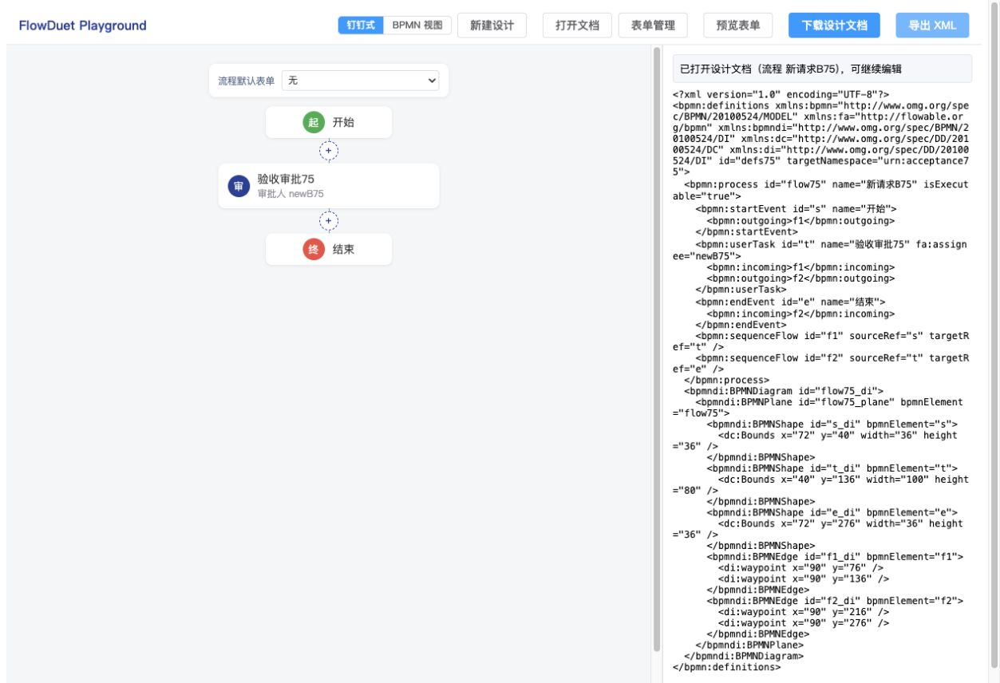

# #75 文件打开竞态修复与复验（2026-09-30）

Codex 浏览器初验的 X06 已修复：旧文件的读取和解析不再覆盖较新打开或新建设计；迟到的读取/解析错误也不再覆盖最新反馈。本轮针对该缺陷的 6 个真实浏览器场景均通过，初验的原生下载落盘和取消选择证据缺口仍保留，不将其定性为产品缺陷。

本文件是 [初验记录](./75-codex-browser-acceptance.md)的后续验证，原始 62 项结果、输入和失败截图不覆盖。被测起点为 `acc4d4e`；代码修复与这份证据按主题单独提交，实际提交号及最终 CI 见 PR #87 的复审评论。

## 修改内容与边界

- `FlowDesignSession.open` 从仅接收字符串兼容扩展为 `string | Promise<string>`。调用开始即登记序号，文本读取后及 XML/表单校验后均验证请求仍为当前请求，通过后才整体替换状态。已有字符串调用继续有效，File 和实际 I/O 保留在宿主。
- Playground 在文件选择时同步登记反馈序号，直接把读取 Promise 交给会话；过期成功、读取错误和文档校验错误均不写入当前界面反馈。新建设计及组件卸载会使旧反馈失效。
- `Promise.resolve().then(() => file.text())` 保证会话在读取动作前登记，读取同步异常也进入 Promise 的错误出口。
- README 与原 form-create minor changeset 同步，无新增依赖。不引入存储模块、不改 core 的解析默认合同，也不替换稳定会话实例。

## 自动化回归

先补测试，在原实现上观察失败：Playground 6 项全部失败；会话的 Promise 入口与解析中被新读取取代的两项失败。修复后 Playground 6 项通过，会话文件 21 项通过。

| 场景                          | 检查                                           |
| ----------------------------- | ---------------------------------------------- |
| 旧 A 迟到成功，B 已成功打开   | B 的状态、XML、表单目录保持                    |
| 旧 A 迟到读取失败或返回坏文档 | 无旧错误提示，B 保持                           |
| 较新 B 失败，A 稍后成功       | 最新错误保持，原未保存模型与表单保留，A 不落地 |
| A 读取中发生新建设计          | 旧成功及旧读取错误均忽略                       |
| 公开 open 接收文本 Promise    | 真实恢复模型和表单                             |
| A 已进入解析，B 尚在读取      | A 不能提交临时模型；B 读完后完整恢复           |

最后一个用例在新请求前让出一次微任务，确保 A 越过读取阶段进入真实解析。仅临时移除解析后的守卫时，该用例失败（旧请求错误地 resolve）；恢复守卫后通过。因此它实际覆盖第二次序号检查，并非只测读取后的第一次检查。临时改动已还原。

## Codex 自带浏览器逐项复验

环境：Playground 重建后的生产预览 `http://127.0.0.1:5207/`，Codex In-app Browser。原生文件选择器、页面操作、真实 session/文档解析均参与，辅助代码仅控制指定测试 File.text 的返回时机或读取错误，没有直接改应用模型、没有模拟解析成功。

| 编号 | 顺序与迟到结果                   | 实际结果                                                         |
| ---- | -------------------------------- | ---------------------------------------------------------------- |
| R1   | 慢 A → 快 B → B 成功 → A 成功    | 通过；提示保持“新请求B75”，重新导出 XML 包含 newB75，不含 oldA75 |
| R2   | B 成功后，A 的读取失败           | 通过；B 保持，无旧文件错误提示                                   |
| R3   | B 成功后，A 返回坏 JSON          | 通过；B 保持，无旧校验错误提示                                   |
| R4   | B 是坏 JSON，随后 A 成功         | 通过；B 的 JSON 错误保持，原 XML 包含 keep75，原两张表单仍在     |
| R5   | A 读取中 → 新建设计 → A 成功     | 通过；新建设计、最小流程及新建提示保持                           |
| R6   | A 读取中 → 新建设计 → A 读取失败 | 通过；新建设计保持，无旧读取错误                                 |

[逐项原始结果](./75-race-fix/results.json)与各 R 编号截图、R1–R3 实际 XML 位于 `75-race-fix/`。复验结束已恢复 File.prototype.text 并删除辅助变量。

## 代码复审

独立 code-review 双轴静态复审：Standards 未发现新增规范违规或有依据的代码味道；Spec 确认 A14 的根因、晚到成功/错误与新建失效均被修复，未发现新增实现缺陷。Spec 提出的“解析后守卫测试实际尚未进入解析”建议已加强，并用上述负向验证证明有效。

两个请求序号保护不同边界：会话序号控制模型/目录提交，宿主序号控制 UI 提示；不应只保留其中一侧。浏览器证据和命令结果由主代理执行，不把代理静态意见当作其独立运行验收。

## 本地检查与限制

- `pnpm lint`、`pnpm build`、`pnpm changeset status`、`git diff --check` 通过。构建仍有既有 Playground 大 chunk 提醒。
- FormCreate 默认全量单独执行 108/108 通过；Playground 默认全量单独执行 28/29，既有多目标预览用例（App.integration.test.ts:574）触发 5000ms 超时，新增六个竞态用例均通过。此超时初验前也曾出现，根因未确定；命令行临时扩大超时的诊断结果及最终默认配置 Node 22/24 CI 记录在 PR 复审评论。
- 首次与 build 同时启动的本地 `pnpm test`，core 123/123，designer 118/124：未修改的 designer 文件中出现六项失败（两个单↔多缓冲、ASCII 集合文案、抄送字形、占位串阻断及 5000ms 超时）。单独运行该文件 38/38 通过，未证实根因或其与本修复的因果关系。
- 第二次默认全仓执行 core 123/123、designer 124/124；FormCreate 107/108，既有 components.test.ts:663 仍触发 5000ms 超时，中断后未执行到 Playground。没有提高或改写仓库超时配置，也不把本地默认全仓写成通过。最终 CI 在默认配置下另行核验。
- 本轮不重复整套 62 项浏览器初验，不据六项定向复验宣称原生下载、取消选择或 Flowable 部署已验收。
